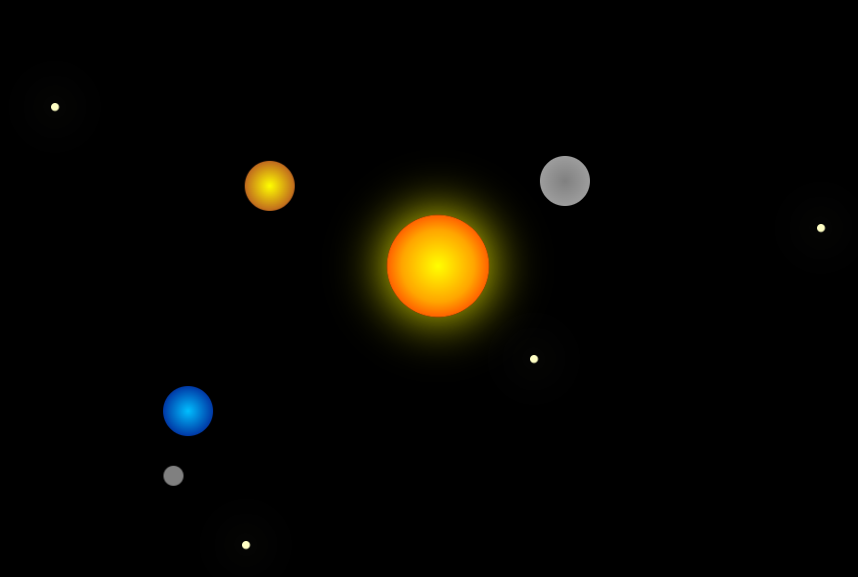
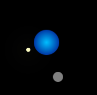

# Simulace Sluneční soustavy

- Tento projekt je jednoduchá vizuální simulace sluneční soustavy vytvořená pouze pomocí HTML a CSS. Planety obíhají kolem Slunce a Měsíc obíhá kolem Země.

 

## Funkce

- Slunce ve středu se světelným pulzováním.

- Planety Merkur, Venuše a Země s přibližně realistickými oběžnými drahami.

- Měsíc obíhající kolem Země.

## Použití

- Stačí otevřít soubor index.html v prohlížeči.

- Simulace se automaticky spustí a planety začnou obíhat kolem Slunce.

## Technologie

- HTML: Struktura stránky

- CSS: Animace a vizuální efekty

#### Možná vylepšení

- Přidání dalších planet.

- Interaktivní prvky pro změnu rychlosti oběhu.

