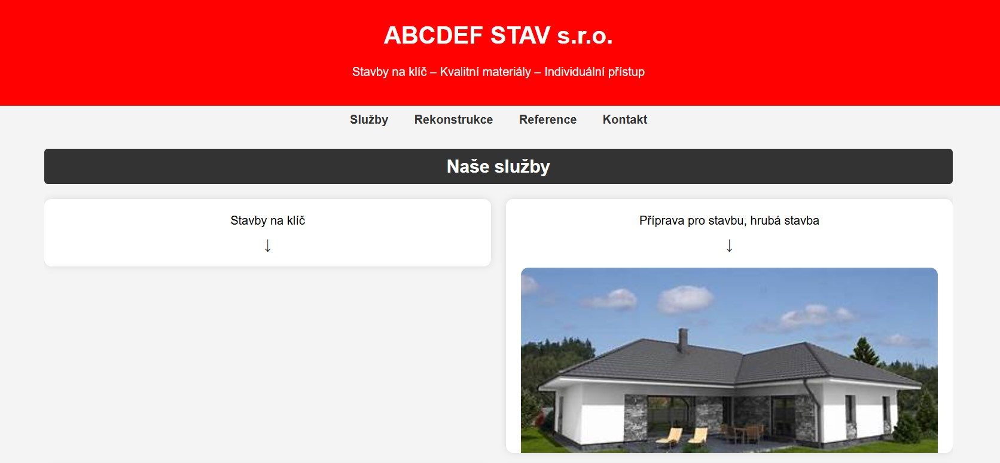
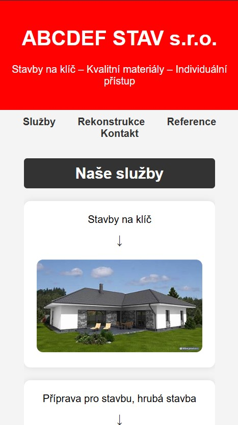

# ABCDEF STAV s.r.o. - Webová stránka

Tento projekt je jednoduchá webová stránka pro stavební společnost **ABCDEF STAV s.r.o.**. Webová stránka obsahuje informace o nabízených službách, referencích a kontaktních údajích.

## Instalace a spuštění
1. Naklonujte nebo stáhněte tento projekt.
2. Otevřete soubor `index.html` v prohlížeči.

## Struktura projektu

```
projekt/
│-- index.html        # Hlavní HTML soubor
│-- style.css         # Styly pro stránku
│-- images/           # Složka s obrázky
│-- README.md         # Dokumentace k projektu
```

## Použité technologie
- **HTML5** – Struktura webu
- **CSS3** – Styly a rozložení stránky

## Sekce webu

1. **Nabízené služby** – Popis služeb, jako jsou stavby na klíč, pokládka dlažby a další.
2. **Rekonstrukce** – Informace o rekonstrukcích historických budov, střech a interiérů.
3. **Reference** – Ukázky dokončených projektů.
4. **Kontakt** – Informace pro zákazníky (email, telefon, sociální sítě).

## Funkce a vlastnosti
- Responzivní design (optimalizace pro mobilní zařízení).
- Interaktivní sekce s rozbalovacími informacemi.
- Grid systém pro přehledné uspořádání kontaktů.
- Moderní a čistý design s CSS stylováním.

## fotografie

 

